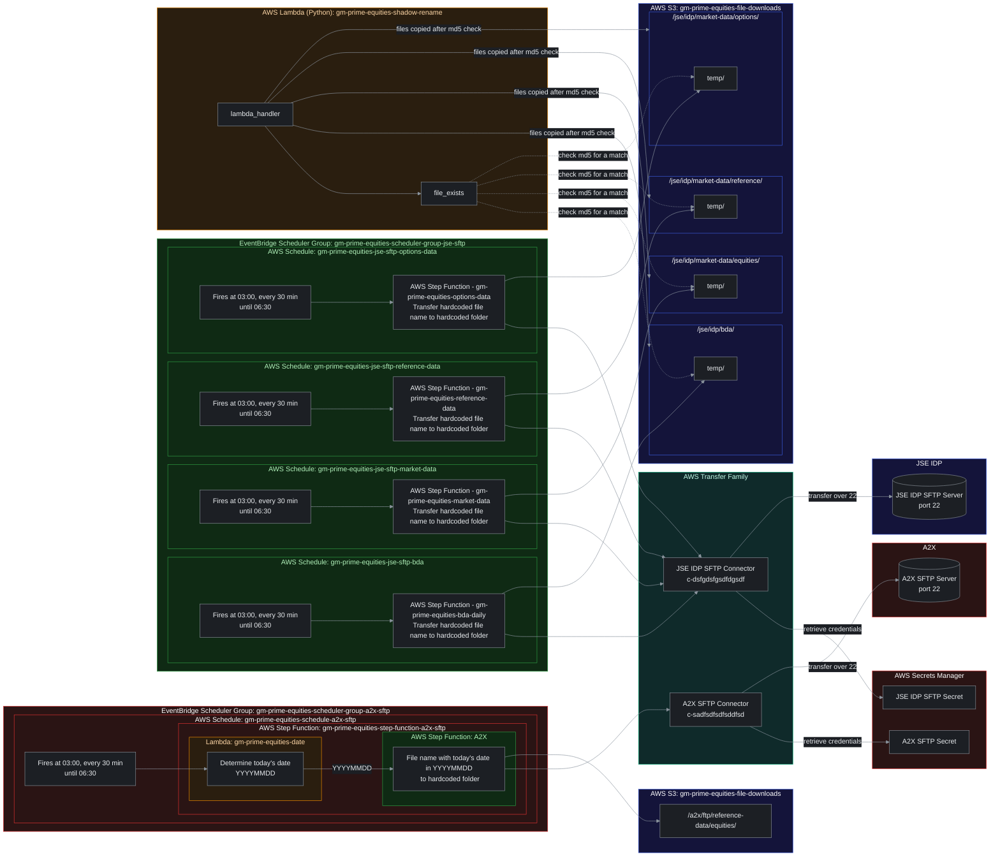

# reimagined-robot

## Documentation

Implementation docs, framed around the AWS Well-Architected Framework, are in [docs/](docs/README.md). They cover the delivery plan, component specs, ADRs, environments, testing and the runbook.

## Getting started

Everything is AWS CDK in TypeScript, except the `Shadow-Rename` Lambda, which is Python. Prerequisites: Node.js ≥ 22 and Python ≥ 3.13. Docker isn't needed.

```bash
npm ci
python -m venv .venv && .venv/Scripts/pip install -r src/lambdas/shadow_rename/requirements-dev.txt   # bin/ on macOS/Linux

npm run lint          # ESLint + Prettier
npm run build         # tsc --noEmit
npm test              # Jest: stack assertions, cdk-nag gate (dev/uat/prod), snapshots, TS Lambda tests
npm run test:python   # pytest for Shadow-Rename
npm run synth         # synthesizes Prime-dev, Prime-uat, Prime-prod
```

Before the first deploy to an environment, fill in every value marked `REPLACE_ME` in `infra/config/<env>.ts`: account ID, vendor SFTP URLs, host keys and remote paths. The account ID can also come from `PRIME_<ENV>_ACCOUNT`. Set the secret values out-of-band ([runbook](docs/operations/observability-and-runbook.md#rotating-vendor-credentials)). Deployment runs through GitHub Actions ([environments and deployment](docs/operations/environments-and-deployment.md#cicd-pipeline)).

## Architecture

Scheduled SFTP ingestion of equities data from A2X and JSE IDP into S3, with an md5-verified move out of the `temp/` staging folders.

### Components

- **EventBridge Scheduler groups**
  - `gm-prime-equities-scheduler-group-a2x-sftp`: schedule `gm-prime-equities-schedule-a2x-sftp` runs Step Function `gm-prime-equities-step-function-a2x-sftp`. A Lambda (`gm-prime-equities-date`) works out today's date (`YYYYMMDD`), then a nested Step Function (`gm-prime-equities-a2x-transfer`) transfers the A2X file.
  - `gm-prime-equities-scheduler-group-jse-sftp`: four schedules (`gm-prime-equities-jse-sftp-bda`, `-market-data`, `-reference-data`, `-options-data`), each running a Step Function (`gm-prime-equities-bda-daily`, `gm-prime-equities-market-data`, `gm-prime-equities-reference-data`, `gm-prime-equities-options-data`) that transfers a hardcoded file to a hardcoded folder.
  - Every schedule fires every 30 minutes from 03:00 to 06:30 SAST on weekdays.
- **AWS Transfer Family**: A2X and JSE IDP SFTP connectors, each pulling from its SFTP server over port 22. Credentials come from AWS Secrets Manager. Dev reuses the existing connectors `c-sadfsdfsdfsddfsd` (A2X) and `c-dsfgdsfgsdfdgsdf` (JSE IDP); uat and prod create their own.
- **S3 bucket `gm-prime-equities-file-downloads-{env}`** (bucket names are global, so each environment adds a suffix)
  - `/a2x/ftp/reference-data/equities/`
  - `/jse/idp/bda/`, `/jse/idp/market-data/equities/`, `/jse/idp/market-data/reference/`, `/jse/idp/market-data/options/`. JSE files land in each folder's `temp/` subfolder first.
- **Lambda `gm-prime-equities-shadow-rename` (Python)**: `lambda_handler` → `file_exists`. Checks the md5 of each file that lands in a JSE `temp/` folder. If a file with that md5 already exists in the parent folder, it deletes the temp file. Otherwise it copies the file to the parent folder with a date-time stamp, for example `BDA_FILE_20261001T033012.csv`, then deletes it from `temp/`. It never overwrites a file.

### Diagram



### Open questions

- **Secret names**: the diagram uses the placeholders "A2X SFTP Secret" and "JSE IDP SFTP Secret". They are not implemented to the diagram yet; uat and prod keep the interim names `prime/{env}/sftp/a2x` and `prime/{env}/sftp/jse-idp`, and dev uses the existing connectors' own secrets.
