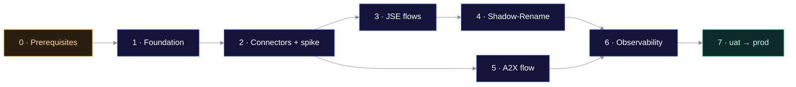

# Implementation plan

This plan covers how to deliver the architecture in the [root README](../README.md#architecture), from an empty repository to production, in eight phases. Each phase ends with acceptance criteria that can be checked. Detailed resource specs are in [component-specs.md](architecture/component-specs.md).

## Scope

**In scope**

- Scheduled retrieval of fixed files from the A2X and JSE IDP SFTP servers through AWS Transfer Family SFTP connectors
- Landing JSE files in `temp/` staging folders, then md5-based de-duplication and promotion by the `Shadow-Rename` Lambda
- A2X date resolution (`YYYYMMDD`) and retrieval
- IaC, CI/CD, monitoring and runbooks for dev, uat and prod

**Out of scope**

- Downstream consumers of the files in S3
- Pushing files to the vendors (the connectors are only used for retrieval)
- Parsing or validating file contents

## Target repository layout

```text
reimagined-robot/
├── package.json                 # scripts: build, lint, test, test:python, test:integration, synth
├── tsconfig.json · cdk.json · eslint.config.mjs · .prettierrc · jest*.config.js
├── .github/workflows/
│   ├── ci.yml                   # lint, tsc, jest, pytest, synth, cdk-nag gate
│   ├── deploy.yml               # dev -> uat -> prod promotion of the CI cloud assembly
│   └── deploy-stage.yml         # one environment: deploy + connector smoke test
├── infra/
│   ├── bin/app.ts               # one IngestionStage per environment
│   ├── config/                  # types.ts, feeds.ts, defaults.ts, dev.ts, uat.ts, prod.ts
│   └── lib/
│       ├── stage.ts             # composes the stacks; registers cdk-nag
│       ├── nag.ts               # AwsSolutionsPlugin + acknowledge() helper
│       ├── stacks/              # storage, transfer, orchestration, processing, monitoring
│       └── constructs/
│           ├── retrieve-file-state-machine.ts
│           ├── feed-schedule.ts
│           ├── typescript-function.ts
│           └── python-code.ts   # local-pip bundling for Python Lambdas
├── src/lambdas/
│   ├── equities-date/           # TypeScript
│   ├── file-deadline-check/     # TypeScript
│   └── shadow_rename/           # Python (the only non-TypeScript code) + tests/
└── test/                        # Jest: stack assertions, cdk-nag gate, snapshots, Lambda unit tests
    └── integration/             # end-to-end against deployed dev (npm run test:integration)
```

## Phases



Phases 3 and 5 can run in parallel once the connectors work.

---

### Phase 0: Prerequisites and decisions

Most of this work is external lead time. Start it first, because the vendors will usually take the longest.

| Task | Owner | Notes |
| --- | --- | --- |
| Create or confirm AWS accounts for dev, uat and prod in AWS Organizations | Platform | See [environments](operations/environments-and-deployment.md#accounts) |
| Bootstrap CDK in each account and region (`cdk bootstrap --trust <tooling-account>`) | Platform | |
| Get SFTP credentials for each vendor and each environment (username and SSH private key preferred) | Integration | Vendor UAT endpoints for uat, production endpoints for prod |
| Get each server's **SSH host public key** out-of-band | Integration | Needed for `TrustedHostKeys`. Don't trust on first use. |
| Send the connectors' **static egress IPs** to A2X and JSE for allowlisting | Integration | The IPs exist only after the connector is created in Phase 2, so plan a round-trip with the vendor |
| Confirm exact remote paths and file-name patterns for each feed | Integration | Fills the "hardcoded file name / folder" in the diagram |
| Resolve the [open questions](architecture/decisions.md#open-questions) | Tech lead | |

**Acceptance criteria**

- [ ] Accounts exist and are bootstrapped.
- [ ] Credentials and host keys are held in a secure hand-off location, never in the repo or chat.
- [ ] The remote path for every feed is documented in `infra/config/*.ts`, with placeholders allowed until confirmed.

---

### Phase 1: Foundation

| Task | Spec |
| --- | --- |
| Scaffold the npm workspace, TypeScript, ESLint, Prettier and Jest | [Repo layout](#target-repository-layout) |
| Create `EnvironmentConfig` and the per-environment config files | [Environments](operations/environments-and-deployment.md#configuration) |
| `StorageStack`: customer-managed KMS key and the `gm-prime-equities-file-downloads-{env}` bucket | [S3](architecture/component-specs.md#1-s3-bucket-and-kms-key) |
| Apply `cdk-nag` to every stage (`AwsSolutionsPlugin`) | [Testing](operations/testing-strategy.md#static-analysis) |
| CI pipeline: lint, `tsc`, Jest, pytest, `cdk synth`, cdk-nag | [Deployment](operations/environments-and-deployment.md#cicd-pipeline) |
| Apply tags to the app: `Project`, `Environment`, `Owner`, `CostCentre` | [Well-Architected: Cost](architecture/well-architected-review.md#cost-optimization) |

**Acceptance criteria**

- [ ] `npm run synth` produces templates for all three stages with zero unsuppressed cdk-nag errors.
- [ ] The bucket is deployed to dev with Block Public Access, SSE-KMS, versioning, the TLS-only policy and EventBridge notifications enabled. Check with `aws s3api get-bucket-*` calls.
- [ ] CI runs on every PR and blocks the merge if it fails.

---

### Phase 2: Transfer Family connectors and API spike

| Task | Spec |
| --- | --- |
| `TransferStack`: one Secrets Manager secret per vendor (value set out-of-band, not in CDK) | [Secrets](architecture/component-specs.md#2-secrets-manager) |
| Create the connector access role and logging role | [Connectors](architecture/component-specs.md#3-transfer-family-sftp-connectors) |
| Create `CfnConnector` for A2X and JSE IDP with `TrustedHostKeys` | same |
| Output the static IPs; send them to the vendors and wait for confirmation that they're allowlisted | Phase 0 |
| Run `aws transfer test-connection` against each connector | [Runbook](operations/observability-and-runbook.md#connector-cannot-connect) |
| **Spike:** run `start-file-transfer` by hand for a known file and a missing file. Record the `StatusCode` and `FailureCode` values returned by `list-file-transfer-results`, and the EventBridge events emitted. | Feeds the Choice states in Phase 3 |

**Acceptance criteria**

- [ ] `test-connection` returns `Status: OK` for both connectors in dev.
- [ ] A manual retrieval lands a file in `s3://gm-prime-equities-file-downloads-dev/jse/idp/bda/temp/`.
- [ ] The spike results are written into [component-specs.md](architecture/component-specs.md#transfer-result-codes), with the exact failure code for "file not found".

---

### Phase 3: JSE retrieval flows

| Task | Spec |
| --- | --- |
| Build the reusable `RetrieveFileStateMachine` construct | [Step Functions](architecture/component-specs.md#4-step-functions-retrieve-file-state-machine) |
| Create four instances: `gm-prime-equities-bda-daily`, `gm-prime-equities-market-data`, `-reference-data`, `-options-data` | same |
| Build the reusable `FeedSchedule` construct: schedule, role, DLQ and retry policy | [Scheduler](architecture/component-specs.md#6-eventbridge-scheduler) |
| Create scheduler group `gm-prime-equities-scheduler-group-jse-sftp` and four schedules (`gm-prime-equities-jse-sftp-*`) | same |

**Acceptance criteria**

- [ ] A manual `StartExecution` for each machine with its schedule input succeeds, and the file appears in the right `temp/` folder.
- [ ] When the file is missing, the execution ends in the `FileNotAvailable` Succeed state, not in a failure.
- [ ] The bda schedule shows these next invocations in the console: 03:00, 03:30 … 06:30 SAST on weekdays.

---

### Phase 4: Shadow-Rename Lambda (Python)

| Task | Spec |
| --- | --- |
| Implement `app.py` with streamed md5, compare, promote or discard | [Shadow-Rename](architecture/component-specs.md#7-shadow-rename-lambda-python) |
| pytest with moto: duplicate, new file, changed file, re-delivery of the same event | [Testing](operations/testing-strategy.md#python-shadow-rename) |
| `ProcessingStack`: `lambda.Function` with `pythonCode()`, EventBridge rule on `jse/idp/*/temp/*`, DLQ, reserved concurrency | same spec |

**Acceptance criteria**

- [ ] If a file with identical content is dropped into `temp/` twice, the parent folder ends up with one object and `temp/` is empty.
- [ ] If a file with new content is dropped in, it's stored in the parent folder as a date-stamped copy with `md5` metadata, and no existing file changes.
- [ ] Processing the same event twice doesn't cause an error or change the outcome (idempotent).

---

### Phase 5: A2X flow

| Task | Spec |
| --- | --- |
| Date Lambda `gm-prime-equities-date` (TypeScript) | [Date Lambda](architecture/component-specs.md#5-date-lambda-typescript) |
| An A2X instance of `RetrieveFileStateMachine` whose remote path is built from the date | [Step Functions](architecture/component-specs.md#a2x-outer-state-machine) |
| Outer state machine `gm-prime-equities-step-function-a2x-sftp`: date Lambda, then `startExecution.sync:2` | same |
| Scheduler group `gm-prime-equities-scheduler-group-a2x-sftp` and its schedule `gm-prime-equities-schedule-a2x-sftp` | [Scheduler](architecture/component-specs.md#6-eventbridge-scheduler) |

**Acceptance criteria**

- [ ] Jest shows the date Lambda returns the SAST date at 23:30 UTC (the next calendar day in SAST).
- [ ] An end-to-end run in dev lands today's A2X file in `a2x/ftp/reference-data/equities/`.

---

### Phase 6: Observability and operations

| Task | Spec |
| --- | --- |
| `MonitoringStack`: SNS topic, alarms, dashboard | [Observability](operations/observability-and-runbook.md) |
| "File not received by deadline" check for each feed | same |
| Write and review the runbook entries | same |

**Acceptance criteria**

- [ ] Forcing a failure (for example a bad remote path) raises an alarm notification within 5 minutes.
- [ ] The dashboard shows execution counts, failures and Lambda errors for every feed.

---

### Phase 7: uat sign-off and production rollout

| Task | Notes |
| --- | --- |
| Promote to uat through the pipeline, pointed at the vendors' UAT endpoints | Manual approval gate |
| Run the [UAT checklist](operations/testing-strategy.md#uat-checklist) over at least 5 business days | Covers real publication-time variance |
| Complete a [Well-Architected review](architecture/well-architected-review.md) sign-off and record any high-risk issues | |
| Promote to prod; confirm the vendors allowlisted the prod connector IPs | Manual approval gate |
| Hypercare: watch the first 5 business days of prod | |

**Acceptance criteria**

- [ ] The UAT checklist is signed off by the business owner.
- [ ] Prod has run for 5 business days with no unexplained failure alarms.

## Risks

| Risk | Impact | Mitigation |
| --- | --- | --- |
| IP allowlisting at the vendor is slow | Blocks Phases 2–7 | Create the connectors early in each environment and start the vendor request on day 1 |
| Vendor rotates the host key without notice | All transfers fail | Alarm on connector failures; runbook step to update `TrustedHostKeys` through config and redeploy |
| File publish time drifts beyond 06:30 | Missed data for the day | "Not received by deadline" alarm; extend the schedule window through config |
| Large files take a long time to hash in the Lambda | Timeouts | Streamed hashing; timeout and memory sized from real file sizes in UAT |
| Transfer Family connector features not available in the chosen region | Architecture change | Check the region in Phase 0 ([open question](architecture/decisions.md#open-questions)) |
