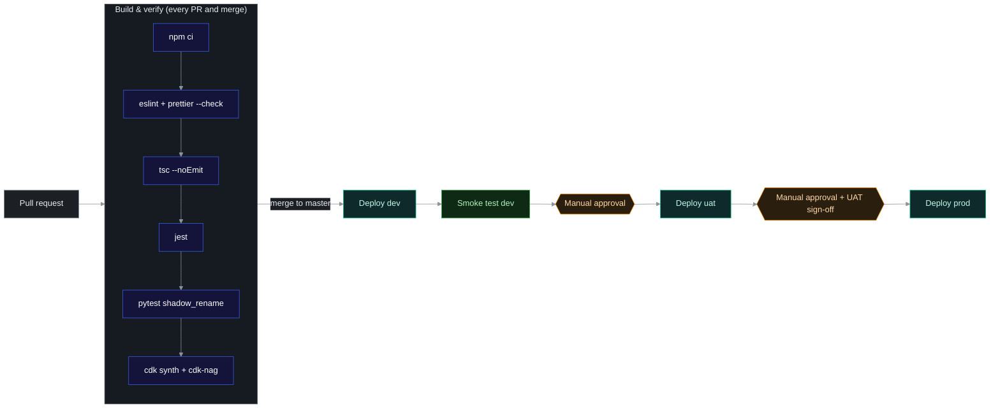

# Environments and deployment

## Environments

| Environment | Purpose | SFTP endpoints | Deploys |
| --- | --- | --- | --- |
| **dev** | Build and integration testing | Vendor test endpoints, or a mock SFTP server ([testing](testing-strategy.md#integration-tests)) | Automatically on merge to `master` |
| **uat** | Business acceptance with realistic data and timings | Vendor **UAT** endpoints | After manual approval |
| **prod** | Live ingestion | Vendor **production** endpoints | After manual approval, following uat sign-off |

### Accounts

Each environment has its own AWS account ([ADR-007](../architecture/decisions.md#adr-007-separate-aws-account-per-environment)), plus a tooling account for the pipeline:

```text
AWS Organization
├── tooling   – CI/CD pipeline, artifact bucket
├── prime-dev
├── prime-uat
└── prime-prod
```

Bootstrap each workload account so it trusts the tooling account:

```bash
npx cdk bootstrap aws://<ACCOUNT_ID>/<REGION> \
  --trust <TOOLING_ACCOUNT_ID> \
  --cloudformation-execution-policies arn:aws:iam::aws:policy/AdministratorAccess   # replace with a scoped policy in prod
```

### Per-environment differences

| Item | dev | uat | prod |
| --- | --- | --- | --- |
| Bucket name | `gm-prime-equities-file-downloads-dev` | `gm-prime-equities-file-downloads-uat` | `gm-prime-equities-file-downloads-prod` |
| Transfer connectors | Existing: `c-sadfsdfsdfsddfsd` (A2X), `c-dsfgdsfgsdfdgsdf` (JSE IDP) | Created by CDK | Created by CDK |
| Log retention | 30 days | 30 days | 90 days |
| Schedules enabled | Optional (off by default to save vendor calls) | On | On |
| Alarm notifications | Email to `tertius.geldenhuys@standardbank.co.za` | Email to `tertius.geldenhuys@standardbank.co.za` | Email to `tertius.geldenhuys@standardbank.co.za` |
| `RemovalPolicy` on bucket and key | `RETAIN` | `RETAIN` | `RETAIN` |
| Connector egress IPs | Allowlisted on vendor test endpoints | Allowlisted on vendor UAT | Allowlisted on vendor prod |

## Configuration

Config is **typed TypeScript** in `infra/config/`. There's no YAML or JSON, so mistakes fail at compile time. Secrets are **never** stored in config; only their names are.

| File | Contents |
| --- | --- |
| [`types.ts`](../../infra/config/types.ts) | `EnvironmentConfig`, `VendorConfig`, `FeedConfig` |
| [`feeds.ts`](../../infra/config/feeds.ts) | Environment-independent names and prefixes: state machines, schedules, schedule groups, S3 prefixes |
| [`defaults.ts`](../../infra/config/defaults.ts) | Shared defaults: the bda window cron, placeholder remote paths, the placeholder file-not-found code |
| [`dev.ts`](../../infra/config/dev.ts), [`uat.ts`](../../infra/config/uat.ts), [`prod.ts`](../../infra/config/prod.ts) | Per-environment values. Anything marked `REPLACE_ME` must be filled in before that environment's first deploy |

```ts
// infra/config/types.ts (abridged)
export interface EnvironmentConfig {
  readonly envName: 'dev' | 'uat' | 'prod';
  readonly account: string;                 // overridable with PRIME_<ENV>_ACCOUNT
  readonly region: string;
  readonly logRetention: RetentionDays;
  readonly alarmEmails: string[];
  readonly fileDeadline: { hour: number; minute: number };  // SAST
  readonly accessLogsBucketName?: string;   // central S3 access-log bucket, if any
  readonly jse: VendorConfig & { readonly feeds: Record<'bda' | 'marketData' | 'referenceData' | 'optionsData', FeedConfig> };
  readonly a2x: VendorConfig & { enabled: boolean; remotePathTemplate: string; schedule: CronOptions };
}
// VendorConfig: sftpUrl, trustedHostKeys, fileNotFoundFailureCode
// FeedConfig:   enabled, remotePath, schedule (CronOptions, interpreted in Africa/Johannesburg)
```

Account IDs can come from the environment (`PRIME_DEV_ACCOUNT`, `PRIME_UAT_ACCOUNT`, `PRIME_PROD_ACCOUNT`) so they don't have to be committed.

[`infra/bin/app.ts`](../../infra/bin/app.ts) creates one `IngestionStage` per environment and applies the app-wide tags. Each stage registers the cdk-nag plugin itself.

`IngestionStage` creates the stacks in dependency order: `Storage` → `Transfer` → `Orchestration` and `Processing` → `Monitoring`. Pass cross-stack references as typed props, not by name.

## CI/CD pipeline

Implemented with **GitHub Actions** and OIDC roles:

- [`ci.yml`](../../.github/workflows/ci.yml) runs on every PR and push.
- [`deploy.yml`](../../.github/workflows/deploy.yml) runs after a green CI on `master`. It promotes the CI-built cloud assembly through [`deploy-stage.yml`](../../.github/workflows/deploy-stage.yml) for dev → uat → prod.

Each GitHub environment (`dev`, `uat`, `prod`) needs a variable `AWS_DEPLOY_ROLE_ARN`, the OIDC role in that account. `uat` and `prod` need **required reviewers** configured as environment protection rules; those are the manual approval gates.



| Step | Command |
| --- | --- |
| Install | `npm ci` and `pip install -r src/lambdas/shadow_rename/requirements-dev.txt` |
| Lint | `npm run lint` (ESLint + Prettier); `ruff check src/lambdas/shadow_rename` |
| Type-check | `npx tsc --noEmit` |
| Unit tests | `npm test` (Jest); `npm run test:python` (pytest) |
| Synthesize | `npm run synth`. CI then fails if `cdk.out/validation-report.json` lists any cdk-nag violation |
| Diff (for review) | `npx cdk diff Prime-<env>/*`, posted to the PR |
| Deploy | `npx cdk deploy --app cdk.out "Prime-<env>/*" --require-approval never` (the pipeline role only), then the smoke test |

**Pipeline rules**

- Only the pipeline deploys to uat and prod. People have read-only access there; break-glass access is audited.
- The same synthesized cloud assembly is promoted through all stages: build once, deploy many.
- A failed deploy rolls back automatically through CloudFormation, so no partial stacks are left behind.

## Smoke test after a deploy

1. Run `aws transfer test-connection --connector-id <id>` for each connector. Expect `"Status": "OK"`.
2. Start `gm-prime-equities-bda-daily` by hand with its scheduled input. Expect `Succeeded` or `FileNotAvailable`.
3. Check that the CloudWatch dashboard shows the execution and that no alarm is in `ALARM`.

## Rollback

- **Code or config regression:** revert the commit and let the pipeline redeploy. Every resource is declarative.
- **Urgent stop:** disable the schedules (set `enabled: false` in config and redeploy, or as a temporary measure `aws scheduler update-schedule ... --state DISABLED`, then make the matching config change).
- **Bad file promoted by Shadow-Rename:** delete the wrong date-stamped copy; earlier copies are never changed ([runbook](observability-and-runbook.md#wrong-file-promoted)).
