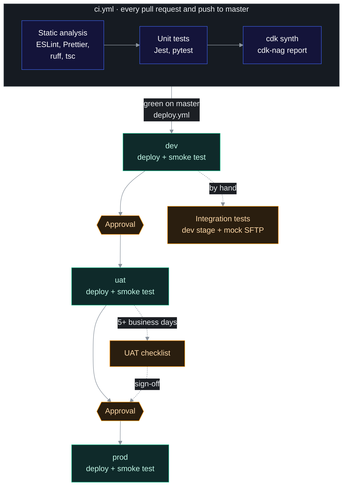
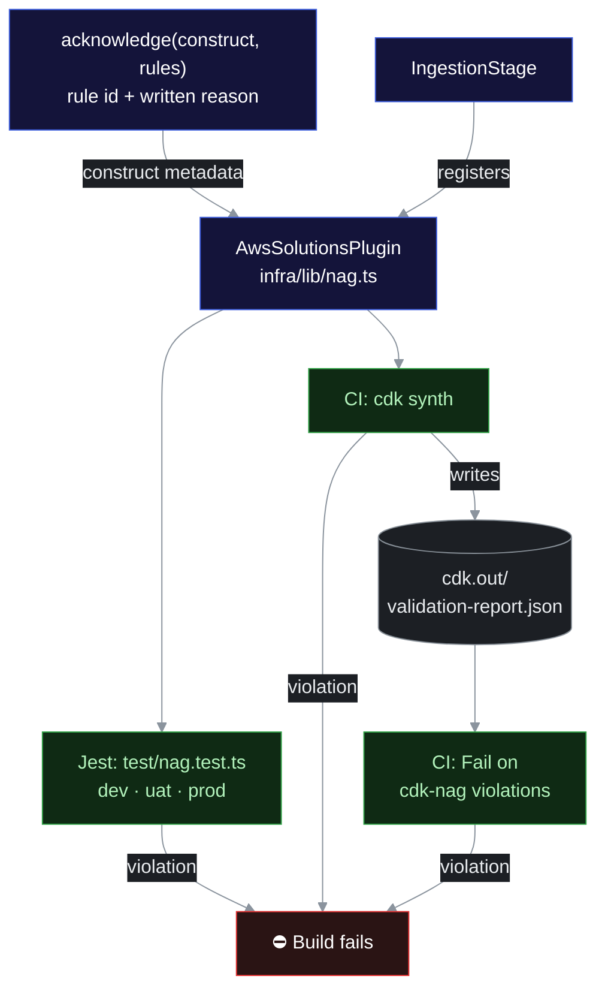
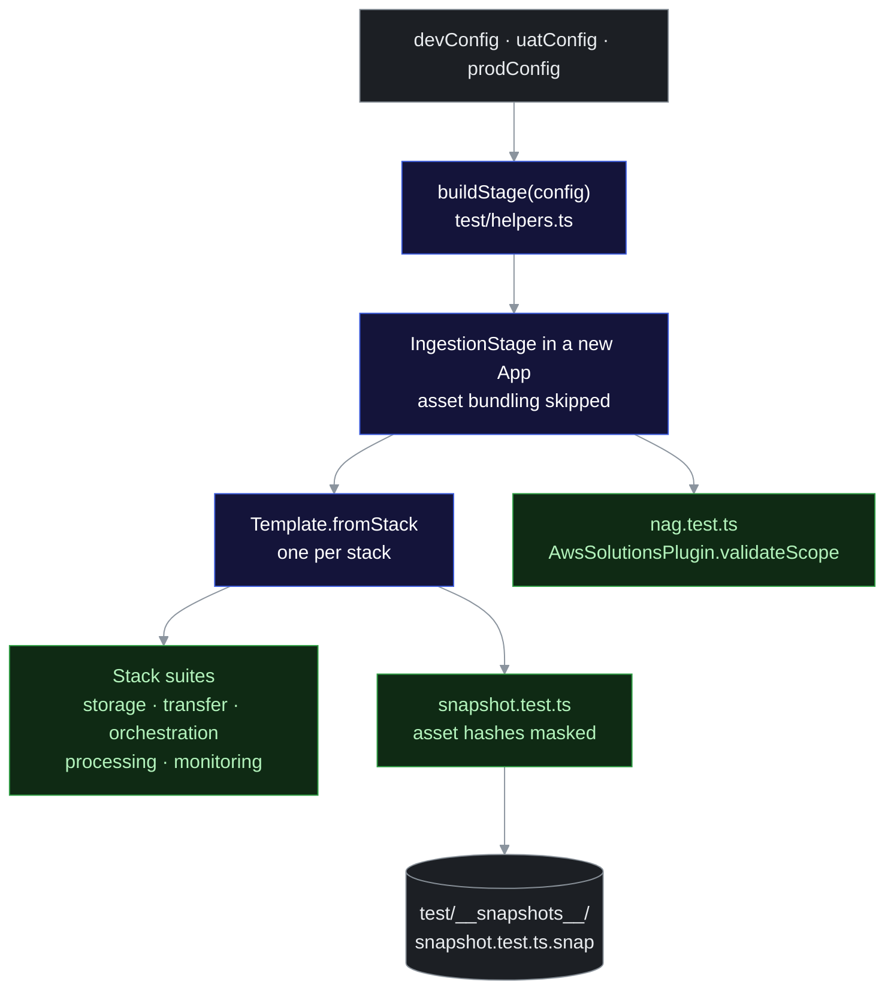
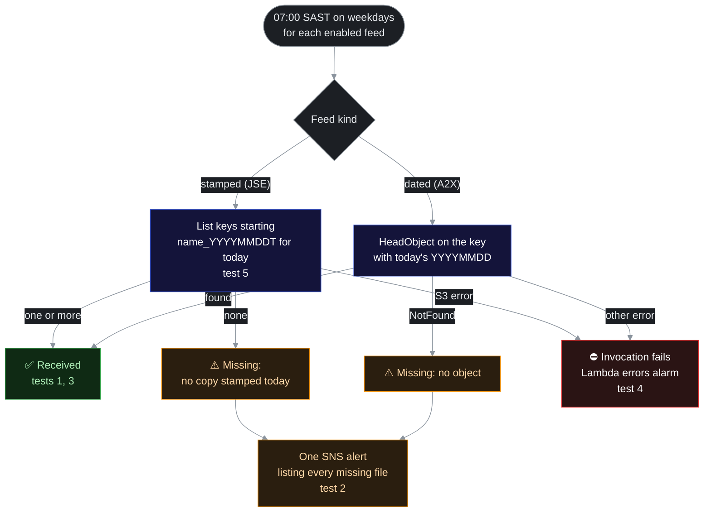
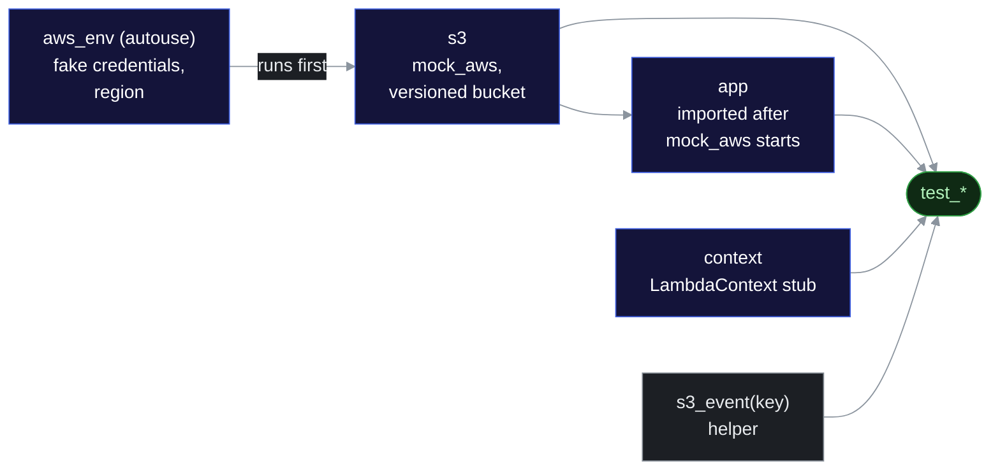
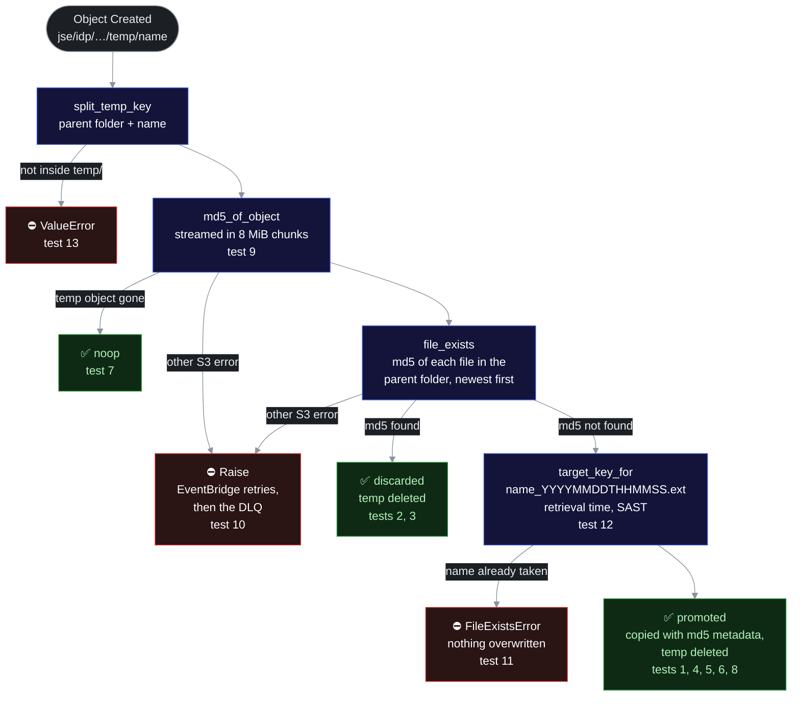

# Testing strategy

<!-- Every Mermaid diagram in this file starts with the same %%{init}%% line (a dark palette that also reads on light pages) and uses the classDef colours from the root README. Copy both from an existing diagram when you add one. -->

Tests are **TypeScript (Jest)** for everything except the Shadow-Rename Lambda, which is tested with **pytest**. Unit tests and static checks run in CI on every pull request and every push to `master` ([pipeline](environments-and-deployment.md#cicd-pipeline)). Integration tests and the UAT checklist need a deployed environment, so they run outside CI.



| Layer | Tooling | Runs | Covers |
| --- | --- | --- | --- |
| Static analysis | ESLint, Prettier, `tsc`, ruff, cdk-nag | CI | Style, types, security rules for the infrastructure |
| Infrastructure unit | Jest + `aws-cdk-lib/assertions` | CI | Resource properties, IAM scope, wiring |
| Infrastructure snapshot | Jest snapshots of the prod templates | CI | Unintended changes to the infrastructure |
| Lambda unit (TS) | Jest; `aws-sdk-client-mock` for AWS calls | CI | Date Lambda, file-deadline check |
| Lambda unit (Python) | pytest + moto | CI | Shadow-Rename |
| Smoke | `aws transfer test-connection` in `deploy-stage.yml` | After every deploy, in each environment | Connector credentials, pinned host key, IP allowlisting |
| Integration | Jest against the deployed dev stage and a mock SFTP server | By hand, after a dev deploy | End-to-end retrieval and promotion |
| UAT | Vendor UAT endpoints | Phase 7, before prod | Real files, real timings |

## Running the tests

| What | Command |
| --- | --- |
| Lint and format | `npm run lint` (ESLint, Prettier); `ruff check` and `ruff format --check` in `src/lambdas/shadow_rename` |
| Type-check | `npm run build` |
| Jest: stacks, cdk-nag, snapshots, TS Lambdas | `npm test` |
| One Jest suite | `npx jest test/orchestration-stack.test.ts` |
| Accept an intended template change | `npm test -- -u`, then commit the updated snapshot |
| Shadow-Rename | `npm run test:python`, with the virtual environment from the [README](../../README.md#getting-started) active |
| Integration | `npm run test:integration` ([below](#integration-tests)) |

## Static analysis

| Check | Command | Scope and rules |
| --- | --- | --- |
| ESLint | `eslint .` | All TypeScript: `@eslint/js` and `typescript-eslint` recommended rules, with formatting rules left to Prettier |
| Prettier | `prettier --check .` | Everything except Markdown, snapshots and `package-lock.json` (`.prettierignore`) |
| tsc | `tsc --noEmit` | `infra/`, `src/` and `test/`: `strict`, no unused locals or parameters, no implicit returns |
| ruff | `ruff check`, `ruff format --check` | Shadow-Rename only: rule sets `E`, `F`, `I`, `B`, `UP`; line length 120; Python 3.14 |
| cdk-nag | Runs inside `npm test` and `cdk synth` | Every stage: dev, uat and prod |

### cdk-nag

`cdk-nag` v3 runs as a policy-validation plugin on every stage (`AwsSolutionsPlugin` in `infra/lib/nag.ts`, see [ADR-009](../architecture/decisions.md#adr-009-cdk-nag-v3-as-a-validation-plugin-with-base-rule-acknowledgements)). Three checks fail the build on an unacknowledged violation:



- `test/nag.test.ts` runs the plugin over the dev, uat and prod stages and expects no violations.
- `cdk synth` exits non-zero when the plugin reports a violation, and writes `cdk.out/validation-report.json`.
- The CI step *Fail on cdk-nag violations* fails if that report lists any violation.

Acknowledge a finding only on the narrowest construct, with a written `reason`. Never acknowledge app-wide. Acknowledging a base rule such as `AwsSolutions-IAM5` also covers its granular findings (`AwsSolutions-IAM5[Resource::…]`) on that construct and its children.

```ts
// infra/lib/stacks/transfer-stack.ts
acknowledge(accessRole, [
  {
    id: 'AwsSolutions-IAM5',
    reason: `Object wildcard limited to ${opts.writePattern}; KMS data-key actions require a wildcard suffix.`,
  },
]);
```

## Infrastructure unit tests (Jest)

Assert the properties that matter for security and reliability, not every property.

Every infrastructure suite builds a whole environment with `buildStage()` from [`test/helpers.ts`](../../test/helpers.ts):



- `buildStage(config)` creates an `IngestionStage` in a new `App`, synthesizes it, and returns a `Template` for each of the five stacks. The default config is dev.
- Asset bundling is turned off (`aws:cdk:bundling-stacks: []`), so unit tests need neither esbuild nor pip.
- `resourcesOf(template, type)` returns `[logicalId, resource]` pairs for assertions over every resource of a type. `json(value)` stringifies a value for substring checks.
- Dev disables every schedule, so suites that expect `ENABLED` schedules build uat or prod.

```ts
// test/storage-stack.test.ts (abridged)
import { Match } from 'aws-cdk-lib/assertions';
import { buildStage } from './helpers';

describe('StorageStack', () => {
  const { storage } = buildStage().templates;

  test('bucket is KMS-encrypted, versioned and private', () => {
    storage.hasResourceProperties('AWS::S3::Bucket', {
      BucketName: 'gm-prime-equities-file-downloads-dev',
      VersioningConfiguration: { Status: 'Enabled' },
      BucketEncryption: {
        ServerSideEncryptionConfiguration: [
          Match.objectLike({
            BucketKeyEnabled: true,
            ServerSideEncryptionByDefault: { SSEAlgorithm: 'aws:kms', KMSMasterKeyID: Match.anyValue() },
          }),
        ],
      },
      PublicAccessBlockConfiguration: {
        BlockPublicAcls: true,
        BlockPublicPolicy: true,
        IgnorePublicAcls: true,
        RestrictPublicBuckets: true,
      },
    });
  });

  test('EventBridge notifications are enabled', () => {
    storage.hasResourceProperties('Custom::S3BucketNotifications', {
      NotificationConfiguration: { EventBridgeConfiguration: {} },
    });
  });

  test('bucket policy denies non-TLS access', () => {
    storage.hasResourceProperties('AWS::S3::BucketPolicy', {
      PolicyDocument: {
        Statement: Match.arrayWith([
          Match.objectLike({ Effect: 'Deny', Condition: { Bool: { 'aws:SecureTransport': 'false' } } }),
        ]),
      },
    });
  });
});
```

CDK turns on EventBridge notifications through a `Custom::S3BucketNotifications` resource, not a property of `AWS::S3::Bucket`, so assert it there.

### What each suite asserts

| Suite | Builds | Assertions |
| --- | --- | --- |
| `storage-stack.test.ts` | dev | SSE-KMS with a Bucket Key, versioning, Block Public Access; EventBridge notifications; bucket and key retained (`DeletionPolicy: Retain`); key rotation; TLS-only bucket policy; lifecycle rules: each JSE `temp/` prefix expires after 7 days, noncurrent versions after 90 days, incomplete multipart uploads after 1 day |
| `transfer-stack.test.ts` | dev | Two connectors with pinned `TrustedHostKeys`, a `UserSecretId` and a logging role; two secrets (`prime/dev/sftp/jse-idp`, `prime/dev/sftp/a2x`) that are CMK-encrypted, retained and have no value in the template; all three roles trust only `transfer.amazonaws.com`, conditioned on `aws:SourceAccount`; each connector can write only to its own landing prefix; egress IP outputs for allowlisting |
| `orchestration-stack.test.ts` | uat, and dev for one test | Six state machines with the diagram names, X-Ray on, `ERROR` logging without execution data; the retrieve definition (`startFileTransfer`, `listFileTransferResults`, `FileNotAvailable`, `TransferFailed`, throttling retries with full jitter, 900 s timeout); the A2X outer machine (`DetermineDate`, `startExecution.sync`, `States.Format` on the remote path template); two schedule groups; the bda schedule (`cron(0/30 3-6 ? * MON-FRI *)` in `Africa/Johannesburg`, flexible window `OFF`, input, DLQ, retry policy); every schedule in its diagram group with the 03:00–06:30 window, targeting the state machine the diagram puts inside it; dev's JSE machines use the JSE connector and the A2X machine the A2X connector; every schedule `DISABLED` in dev; the date Lambda on Node.js 24, arm64, with active tracing |
| `processing-stack.test.ts` | dev | Shadow-Rename on Python 3.14, arm64, handler `app.lambda_handler`, reserved concurrency 1, active tracing; the rule matches `Object Created` with key wildcard `jse/idp/*/temp/*`; the target has a DLQ, 4 retries and a 2-hour maximum event age; `s3:DeleteObject` only on `jse/idp/*/temp/*` |
| `monitoring-stack.test.ts` | prod | KMS-encrypted alert topic with an email subscription; `failed` and `timed-out` alarms for all six state machines; error alarms for all three Lambdas; depth alarms for all four DLQs; every alarm has `TreatMissingData: notBreaching` and an alarm action; the deadline check schedule (`cron(0 7 ? * MON-FRI *)` in `Africa/Johannesburg`, `ENABLED`) and its function's `BUCKET_NAME` and `FEEDS`; an EventBridge rule for `SFTP Connector File Retrieve Failed`; the dashboard |
| `nag.test.ts` | dev, uat, prod | No unacknowledged cdk-nag violations ([cdk-nag](#cdk-nag)) |
| `snapshot.test.ts` | prod | One snapshot per stack ([snapshot tests](#snapshot-tests)) |

### Snapshot tests

```ts
// test/snapshot.test.ts
import { prodConfig } from '../infra/config';
import { buildStage } from './helpers';

/** Asset hashes depend on line endings and local paths; mask them so snapshots are portable. */
const normalise = (template: unknown): unknown =>
  JSON.parse(JSON.stringify(template).replace(/[a-f0-9]{64}(\.zip|\.json)?/g, '<asset-hash>$1'));

describe('template snapshots (prod)', () => {
  const { templates } = buildStage(prodConfig);

  test.each(Object.keys(templates) as (keyof typeof templates)[])('%s', (name) => {
    expect(normalise(templates[name].toJSON())).toMatchSnapshot();
  });
});
```

- There's one snapshot for each of the five stacks, built from the **prod** config, in `test/__snapshots__/snapshot.test.ts.snap`.
- Asset hashes are masked, so a snapshot changes when the infrastructure changes, not when only Lambda code changes. The Lambda unit tests cover the code.
- CI runs `npm test -- --ci`, which fails on a missing snapshot instead of writing it. After an intended change, run `npm test -- -u` and commit the result.
- Reviewers must read snapshot diffs in PRs.

## Lambda unit tests

### TypeScript: date Lambda

```ts
// test/equities-date.test.ts (abridged)
import { handler, toBusinessDate } from '../src/lambdas/equities-date';

describe('toBusinessDate', () => {
  test('uses SAST, not UTC, across midnight', () => {
    // 22:30 UTC on 30 Sep = 00:30 SAST on 1 Oct
    expect(toBusinessDate(new Date('2026-09-30T22:30:00Z'))).toBe('20261001');
  });
});

describe('handler', () => {
  afterEach(() => jest.useRealTimers());

  test('returns the current SAST date', async () => {
    jest.useFakeTimers({ now: new Date('2026-12-31T22:15:00Z') });
    await expect(handler({})).resolves.toEqual({ businessDate: '20270101' });
  });

  test('rejects a malformed override', async () => {
    await expect(handler({ businessDate: '2026-01-02' })).rejects.toThrow('Invalid businessDate');
  });
});
```

The file also checks the same calendar day at 03:00 SAST, zero-padded months and days, a `null` payload, and a valid `businessDate` override.

### TypeScript: file-deadline check

`gm-prime-file-deadline-check` ([observability](observability-and-runbook.md#file-not-received-by-deadline-check)) runs at 07:00 SAST on weekdays and alerts on any file that hasn't arrived.

- `aws-sdk-client-mock` replaces `S3Client` and `SNSClient`, and `aws-sdk-client-mock-jest` adds matchers such as `toHaveReceivedCommandWith`.
- The module creates its SDK clients, Logger and Metrics when it's first imported. The test therefore sets `AWS_REGION`, `BUCKET_NAME`, `ALERT_TOPIC_ARN`, `FEEDS` and the Powertools variables first, then imports the handler once.
- Fake timers fix the clock at 07:00 SAST on 1 Oct 2026.
- `FEEDS` holds one feed of each kind: `bda` (`stamped`: Shadow-Rename's date-stamped copies) and `a2x` (`dated`: a key where `{}` becomes `YYYYMMDD`).

The numbers in the diagram are the tests in the table below it.



| # | Test | Given | Expect |
| --- | --- | --- | --- |
| 1 | `no alert when every file arrived today` | A bda copy stamped today exists; the A2X object exists | `missing` is empty; the bda listing used the prefix `jse/idp/bda/BDA_FILE_20261001T`; the A2X key resolves to `EQ_REF_20261001.csv`; nothing published |
| 2 | `alerts when no copy is stamped today or a dated file is missing` | No bda copy stamped today; A2X `NotFound` | Both listed with a reason; **one** SNS message naming both |
| 3 | `just after midnight SAST, looks for the SAST date, not the UTC date` | Clock at 22:30 UTC on 30 Sep, which is 00:30 SAST on 1 Oct | The listing prefix uses `20261001` |
| 4 | `unexpected S3 errors propagate so the invocation fails and alarms` | `ListObjectsV2` rejects with `AccessDenied` | The handler rejects, so the Lambda errors alarm fires |
| 5 | `stamp prefix of %s matches the name Shadow-Rename writes` (3 cases) | `BDA_FILE.csv`, `OPTIONS.tar.gz`, a name without an extension | `BDA_FILE_20261001T`, `OPTIONS.tar_20261001T`, `NO_EXTENSION_20261001T`: split at the last dot, like Python's `splitext` |

### Python: Shadow-Rename

The fixtures in `tests/conftest.py` give every test a mocked, versioned bucket:



```python
# src/lambdas/shadow_rename/tests/conftest.py (abridged)
BUCKET = "gm-prime-equities-file-downloads-test"
REGION = "af-south-1"


@pytest.fixture(autouse=True)
def aws_env(monkeypatch):
    monkeypatch.setenv("AWS_DEFAULT_REGION", REGION)
    monkeypatch.setenv("AWS_ACCESS_KEY_ID", "testing")
    monkeypatch.setenv("AWS_SECRET_ACCESS_KEY", "testing")
    monkeypatch.setenv("POWERTOOLS_SERVICE_NAME", "shadow-rename")


@pytest.fixture
def s3():
    with mock_aws():
        client = boto3.client("s3", region_name=REGION)
        client.create_bucket(Bucket=BUCKET, CreateBucketConfiguration={"LocationConstraint": REGION})
        client.put_bucket_versioning(Bucket=BUCKET, VersioningConfiguration={"Status": "Enabled"})
        yield client


@pytest.fixture
def app(s3):
    """Import the handler after mock_aws is active so its module-level boto3 client is mocked."""
    sys.modules.pop("app", None)
    return importlib.import_module("app")
```

- `app.py` creates its boto3 client at import time. The `app` fixture depends on `s3`, so it imports a fresh copy of the module only once `mock_aws` is active. Take `app` as a fixture; don't `import app` at the top of a test module.
- `context` returns a `LambdaContext` stub, because `@logger.inject_lambda_context` reads the function name, memory size, ARN and request ID.
- `s3_event(key)` builds the EventBridge `Object Created` event that the rule delivers.

Each test drives `lambda_handler` down one branch. The numbers in the diagram are the tests in the table below it.



| # | Test | Given | Expect |
| --- | --- | --- | --- |
| 1 | `test_new_file_promoted_with_timestamp` | Nothing in the parent folder | One copy, `BDA_FILE_<YYYYMMDDTHHMMSS>.csv`, with `md5` metadata; temp deleted; `action == "promoted"` |
| 2 | `test_duplicate_of_latest_copy_discarded` | The newest copy has the same content | Nothing added; temp deleted; `action == "discarded"`, and `duplicate_of` names that copy |
| 3 | `test_duplicate_of_older_copy_discarded` | An older copy, not the newest, has the same content | Discarded as a duplicate of the older copy |
| 4 | `test_changed_file_adds_a_copy_and_keeps_the_others` | A copy with different content exists | A second copy is added; the existing copy keeps its content and VersionId |
| 5 | `test_file_without_md5_metadata_never_matches` | A file with the same content but no `md5` metadata, for example uploaded by hand | Promoted as a new copy; the existing file is untouched |
| 6 | `test_only_the_parent_folder_counts` | The same content in another feed's folder | Promoted |
| 7 | `test_redelivered_event_is_noop` | The same event handled twice | The second call returns `{"action": "noop"}`; still one copy |
| 8 | `test_nested_market_data_path` | Key `jse/idp/market-data/options/temp/f.csv` | Stored as `jse/idp/market-data/options/f_<YYYYMMDDTHHMMSS>.csv` |
| 9 | `test_large_file_streams` | 20 MiB + 7 bytes, spanning several 8 MiB chunks | md5 is correct |
| 10 | `test_unexpected_s3_error_raises` | `head_object` raises `AccessDenied` during the duplicate check | `ClientError` propagates, so EventBridge retries and the DLQ catches it; temp object left in place |
| 11 | `test_never_overwrites_an_existing_file` | A different file already has the stamped name | `FileExistsError`; the existing file and the temp object are untouched |
| 12 | `test_target_key_for` (3 cases) | Retrieved 01:30:12 UTC; retrieved 22:30 UTC the day before; a name without an extension | `BDA_FILE_20261001T033012.csv`; `b_20261001T003000.csv`, dated the next day because the stamp is SAST; `NO_EXTENSION_20261001T033012` |
| 13 | `test_target_key_for_rejects_non_temp_keys` (2 cases) | A key outside `temp/`; a key that ends in `temp/` | `ValueError` |

## Integration tests

Run these by hand against the **deployed dev stage** after a dev deployment. The pipeline doesn't run them.

- **SFTP target.** Point the dev JSE connector at a mock SFTP server that we control, such as an `atmoz/sftp` container on a small, separate, locked-down host, or a Transfer Family *server* in a sandbox account. That way tests don't depend on vendor availability. Set `jse.sftpUrl` and `jse.trustedHostKeys` in `infra/config/dev.ts`, and store the mock server's credentials in the `prime/dev/sftp/jse-idp` secret.
- **Runner.** `npm run test:integration` uses `jest.integration.config.js`, which runs only `test/integration/**/*.int.test.ts`, with a 15-minute timeout per test. The unit config ignores `test/integration/`. The suite uses the AWS SDK v3 and `ssh2-sftp-client`.
- **Environment.** The suite is **skipped**, not failed, unless `MOCK_SFTP_HOST`, `MOCK_SFTP_USER` and `MOCK_SFTP_PRIVATE_KEY` are all set.

| Variable | Value |
| --- | --- |
| AWS credentials and `AWS_REGION` | The dev account |
| `PRIME_ENV` | Environment under test; default `dev` |
| `MOCK_SFTP_HOST` | Host of the mock SFTP server the dev JSE connector points at |
| `MOCK_SFTP_PORT` | Default `22` |
| `MOCK_SFTP_USER` | SFTP user that uploads the fixtures |
| `MOCK_SFTP_PRIVATE_KEY` | Path to that user's private key |

The suite exercises the bda feed. The diagram shows test 1; tests 2 to 4 repeat it with the same file, a changed file and a missing path.

```mermaid
%%{init: {"theme": "base", "themeVariables": {"darkMode": true, "background": "#0d1117", "primaryColor": "#1c1f24", "primaryTextColor": "#e9ecef", "primaryBorderColor": "#868e96", "lineColor": "#8b949e", "arrowheadColor": "#8b949e", "clusterBkg": "#161b22", "clusterBorder": "#495057", "titleColor": "#e9ecef", "edgeLabelBackground": "#1c1f24", "noteBkgColor": "#2a1e0f", "noteTextColor": "#ffd8a8", "noteBorderColor": "#f08c00"}}}%%
sequenceDiagram
    autonumber
    participant J as Jest
    participant F as Mock SFTP
    participant SF as bda state machine
    participant C as JSE connector
    participant S3 as S3
    participant SR as Shadow-Rename
    rect rgb(22, 27, 34)
        J->>F: Upload fixture
        J->>SF: StartExecution
        SF->>C: StartFileTransfer
        C->>F: Fetch over SFTP
        C->>S3: Put in temp/
        loop Every 30 s
            SF->>C: ListFileTransferResults
        end
        loop Every 5 s until not RUNNING
            J->>SF: DescribeExecution
        end
        S3-)SR: Object Created<br/>through EventBridge
        SR->>S3: Promote, delete temp
        loop Every 5 s, up to 5 min
            J->>S3: HeadObject, ListObjectsV2
        end
    end
```



| # | Test | Steps | Expect |
| --- | --- | --- | --- |
| 1 | `a new file is stored as a date-stamped copy with md5 metadata` | Upload a unique fixture; start `gm-prime-equities-bda-daily` | `SUCCEEDED`; a copy named `BDA_FILE_<YYYYMMDDTHHMMSS>.csv` carries the fixture's `md5`; `temp/` is empty |
| 2 | `retrieving the same content again is discarded as a duplicate` | Start the machine again without changing the file | `SUCCEEDED`; `temp/` empties; no copy is added |
| 3 | `changed content is stored as a new copy and the first copy is kept` | Upload changed content; start the machine | `SUCCEEDED`; a second copy with the new `md5`; the first copy keeps its key, `md5` and VersionId |
| 4 | `a missing remote file ends in FileNotAvailable, not a failure` | Start the machine with `/does-not-exist/<uuid>.csv` | `SUCCEEDED` |

- The tests share state (tests 2 and 3 check the copy that test 1 stored), so run the whole file.
- Test 4 can only succeed through the `FileNotAvailable` state, so it also checks that `fileNotFoundFailureCode` matches the code Transfer Family returns. Until the Phase 2 spike confirms that code, config holds a placeholder (`FILE_NOT_FOUND` in `infra/config/defaults.ts`).

## UAT checklist

Run this in **uat** against the vendors' UAT endpoints for at least 5 business days.

- [ ] Every feed retrieves its file at the scheduled time, every business day.
- [ ] The bda polling window catches the file; record the actual publish times.
- [ ] Repeated bda pulls produce exactly one promoted file a day (no duplicates in the parent folder).
- [ ] The A2X file name resolves to the correct SAST date.
- [ ] Each alarm, and the 07:00 deadline check, is forced at least once (bad path, revoked secret, disabled IP) and reaches the right recipients.
- [ ] Shadow-Rename duration and memory measured against the largest real file. Memory and timeout adjusted.
- [ ] The runbook was followed by someone outside the build team for at least one simulated incident.
- [ ] Downstream consumers confirm the file locations and formats.

## Known gaps

- **Integration tests aren't automated.** `deploy-stage.yml` runs only the connector smoke test after each deploy.
- **Scheduler role scope isn't asserted.** Each schedule has its own `SchedulerRoleForTarget-*` role, which can start only its own state machine and send only to its group's DLQ. The prod snapshot records this, but no test asserts it.
- **Shadow-Rename sizing isn't unit-tested.** Duration and memory under real file sizes are measured in UAT.
